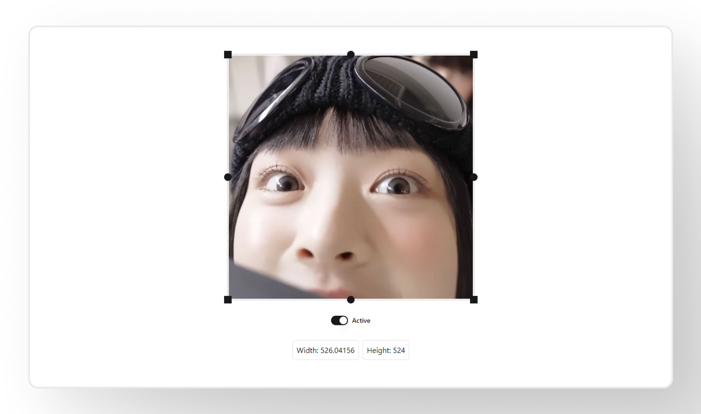

# Svelte Image Resizer 🚀

This project provides a simple and customizable image resizer with a drag handler, supporting both mouse and touch interactions.

You can use this project for improving the flexibility of image functionality in a headless WYSIWYG editor (e.g., tiptap).

## NPM Package Installation

The npm package for this project will be available soon. Stay tuned for updates!